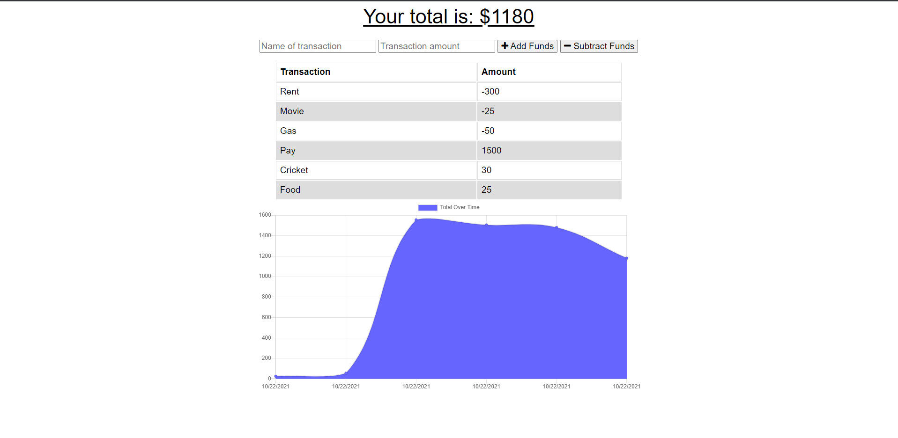

# Anytime-Budget

## Description
A progressive web app that allows a user to track there expenses and budget accordingly. Features include adding expenses and deposits to their budget with or without being connected to the internet. 

## Table of Contents
  * [Installation](#installation)
  * [Usage](#usage)
  * [License](#license)
  * [How to Contribute](#how-to-contribute)
  * [Questions](#questions)

## Installation
1. Clone this repository to your console/ device.
2. `npm install` to install the required dependicies.

## Usage
Open the application via the deployed Heroku Link below.
LINK: https://floating-cove-02210.herokuapp.com/

OR once you have cloned the repository
  * In your terminal / console invoke the commenad:
    `node server.js`
  * Open your browser and go to
    `http://localhost:3000`
  
Users can add transactions as deposits or expenses by imputting the following:
  * Name of transation
  * Transaction amount
  * If wanting to deposit - select **Add Funds**
  * If wanting to input an expense - select **Subtract Funds**

Once funds are added or subtracted your total amount is displayed at the top of the app.

A graph at the bottom of the app gives the user a visual represation of total funds over time.

This application can be used both online and offline

Offline functionality includes:
  * Enter deposits offline.
  * Enter expenses offline.

When back online:
 * Offline entries added back to the tracker.

## License
This application is covered under the MIT license.

## How to Contribute
Please contact me for further information if you wish to be a contributor on this project.

## Questions
Created by [Pasgen-Manley](https://github.com/Pasgen-Manley)

If you have any questions please contact me at [pasgen95@gmail.com](pasgen95@gmail.com)